# AYGO-Virtualization-and-Distributed-Programming

This project is a small application for registering arrivals. Whoever opens the page types their name, presses *Submit*, and the system stores that name together with the exact time it was registered. Below the form there is a list of every arrival recorded so far, newest first, which refreshes without reloading the page.

The functionality is deliberately simple: the point of the lab is how it is split across several machines. The application is divided into a client that runs in the browser, an API Gateway, and a monolithic backend with its own database. These pieces are deployed on two separate EC2 instances, and the backend is packaged in Docker containers.

## Architecture

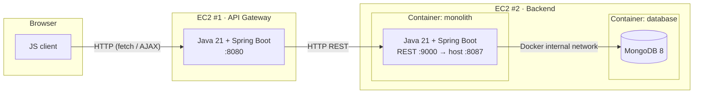

A request travels through the system from left to right. When someone registers their name, the browser sends it to the gateway. The gateway checks that it is valid and passes it on to the monolith, which assigns the time and stores it in MongoDB. The response follows the same path back to the page, which then asks for the list again to show the new entry.

### The client

The client is an HTML page with a bit of JavaScript (`gateway/src/main/resources/static`). It has a text field for the name, the *Submit* button and a table with the arrivals. When the form is submitted, the JavaScript intercepts the browser's normal submission and sends the request asynchronously with `fetch`, so the page never reloads. If something goes wrong, such as an empty name or the backend being down, it shows the error message below the form.

Although the code runs in the browser, the files are served by the gateway itself. This way the page and the API share the same origin: the browser does not block the requests because of CORS, and there is no need for an extra server just to serve three static files.

### The API Gateway

The gateway (`gateway/`) is a Spring Boot application that runs directly on Java on the first EC2 instance, without a container. It is the only entry point to the system: the browser never talks to the monolith.

Its job is to receive the client's requests, validate them and forward them. To register an arrival, it requires the name to be non-empty and no longer than 100 characters. If the name does not meet these rules, the gateway responds with `400` and a message explaining the problem, and the request goes no further. If it is valid, the gateway forwards it to the monolith and returns its response unchanged. When the monolith does not answer, because it is down or taking too long, the gateway gives up after a few seconds and responds with `502`. The user gets a clear notice instead of a page that keeps waiting.

### The monolith

The monolith (`monolith/`) is another Spring Boot application, this time packaged as a Docker image and run on the second EC2 instance. It holds the business logic and exposes two REST services: one to create an entry and one to retrieve the list.

The arrival time is set by the monolith when it receives the entry, not by the browser. That way every entry uses the same clock, and nobody can change the time by tampering with the JavaScript. It is stored in UTC, and the page converts it to the viewer's local time.

### The database

Entries are stored in MongoDB, which runs in its own container on the same instance as the monolith. Each arrival is a document in the `arrivals` collection with three fields: the identifier generated by MongoDB, the name and the time.

Both containers are started together with Docker Compose. MongoDB does not publish its port to the outside. It can only be reached from the internal network Compose creates between the two containers, where the monolith finds it by the name `db`. Since MongoDB runs without authentication, exposing that port would leave the data open to anyone. The data lives in a Docker volume, so it survives even if the containers are removed and recreated.

### Communication between the instances

The gateway calls the monolith using the second instance's private IP, so the traffic stays inside the AWS network and never goes through the internet. The monolith's Security Group only accepts traffic on its port when it comes from the gateway. Only the gateway is visible from the internet; if someone tries to call the monolith directly, the connection never gets through.

## Code organization

Each application is an independent Maven project, with its code split into packages by responsibility.

```
.
├── gateway/                     API Gateway + web client
│   ├── pom.xml
│   ├── deploy/gateway.service   systemd service for the EC2
│   └── src/main/
│       ├── java/co/edu/escuelaing/gateway/
│       │   ├── GatewayApplication.java
│       │   ├── config/
│       │   │   ├── MonolithProperties.java    monolith URL and timeouts
│       │   │   └── MonolithClientConfig.java  RestClient for the monolith
│       │   ├── controller/
│       │   │   └── GatewayController.java     /api/arrivals → monolith
│       │   └── dto/
│       │       └── ArrivalRequest.java        name validation
│       └── resources/
│           ├── application.properties
│           └── static/                        index.html, app.js, styles.css
└── monolith/                    Backend
    ├── pom.xml
    ├── Dockerfile
    ├── compose.yaml             monolith + MongoDB
    └── src/main/
        ├── java/co/edu/escuelaing/monolith/
        │   ├── MonolithApplication.java
        │   ├── controller/
        │   │   └── ArrivalController.java     /arrivals
        │   ├── dto/
        │   │   └── ArrivalRequest.java        POST body
        │   ├── model/
        │   │   └── Arrival.java               MongoDB document
        │   └── repository/
        │       └── ArrivalRepository.java
        └── resources/
            └── application.properties
```

The gateway has three packages:
- `controller` receives the browser's requests.
- `dto` defines which data is accepted and how it is validated.
- `config` sets up the HTTP client used to talk to the monolith.

The monolith has four:
- `controller` exposes the REST services.
- `model` represents the stored document.
- `repository` reads from and writes to MongoDB.
- `dto` describes the body of incoming requests.

### Configuration

No address or port is hard-coded. Each application reads its configuration from `application.properties`, and any value can be overridden with an environment variable at deployment time. That is why the same jar works both locally and on AWS. Locally the defaults are used, and on the EC2 the gateway's service defines `MONOLITH_URL` with the monolith's private IP.

| Application | Property | Environment variable | Default |
|---|---|---|---|
| Gateway | `server.port` | `PORT` | `8080` |
| Gateway | `monolith.url` | `MONOLITH_URL` | `http://localhost:8087` |
| Gateway | `monolith.connect-timeout` / `monolith.read-timeout` | — | `3s` / `5s` |
| Monolith | `server.port` | `PORT` | `9000` |
| Monolith | `spring.mongodb.uri` | `SPRING_MONGODB_URI` | `mongodb://localhost:27017/arrivals` |

Inside its container the monolith listens on port 9000, and Docker publishes it on port 8087 of the instance. That is why the gateway points to 8087.

## REST services

The gateway exposes the public API on port 8080. The page uses this API, and it can be tested from outside AWS.

| Method | Path | Body | Response |
|---|---|---|---|
| `GET` | `/` | — | The page with the form |
| `POST` | `/api/arrivals` | `{"name": "Ana"}` | `201` with the created entry · `400` if the name is invalid · `502` if the monolith does not respond |
| `GET` | `/api/arrivals` | — | `200` with the list of arrivals, newest first · `502` if the monolith does not respond |

The monolith exposes the internal services, which can only be reached from the gateway.

| Method | Path | Body | Response |
|---|---|---|---|
| `POST` | `/arrivals` | `{"name": "Ana"}` | `201` with the stored entry, e.g. `{"id": "6ac2f586…", "name": "Ana", "timestamp": "2026-10-05T00:55:34.799Z"}` |
| `GET` | `/arrivals` | — | `200` with the list sorted by time, newest first |

## Requirements

- Java 21 and Maven 3.9+
- Docker with `buildx` and Docker Compose
- A Docker Hub account
- Two EC2 instances (Amazon Linux 2023) in the same VPC

```bash
java -version
mvn -v
docker version
docker buildx version
docker compose version
```

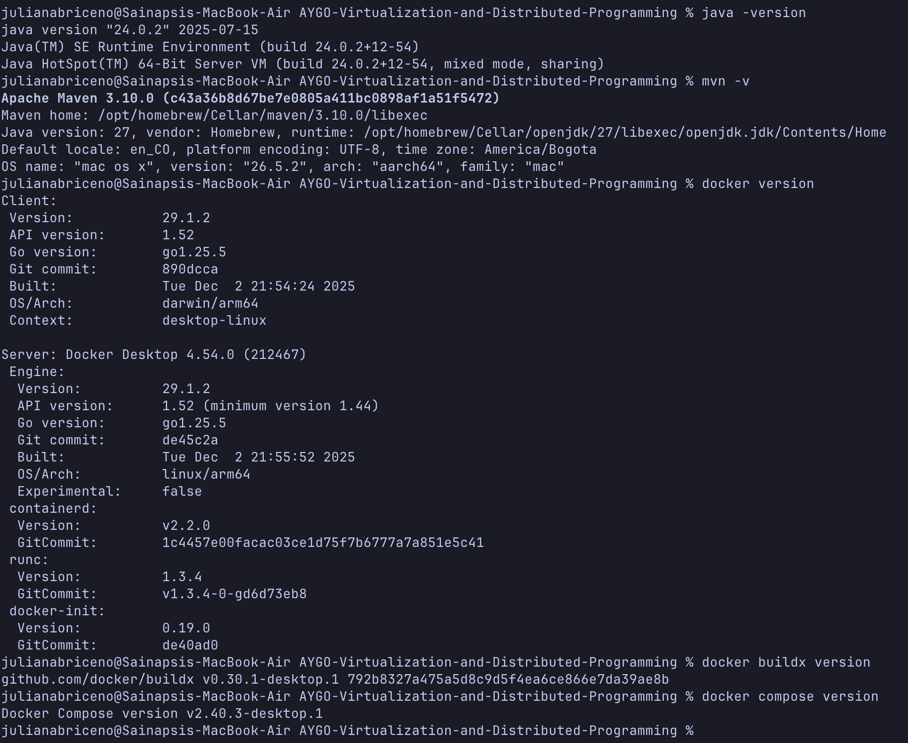
*Figure 1. Versions of the tools on the development machine: Java 21, Maven 3.9, Docker, `buildx` and Docker Compose.*

## Running locally

First build the monolith and start it together with MongoDB:

```bash
cd monolith
mvn clean package
```

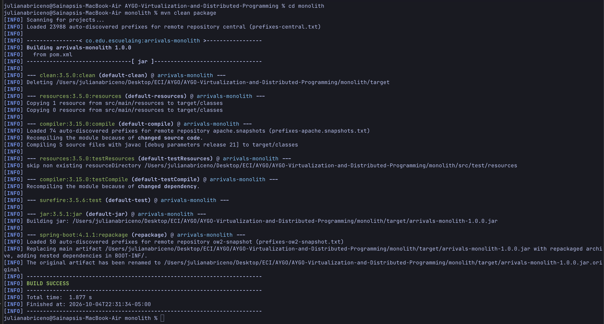
*Figure 2. `mvn clean package` in `monolith/` ends with `BUILD SUCCESS` and produces `target/arrivals-monolith-1.0.0.jar`.*

```bash
docker compose up --build -d
docker compose ps
```

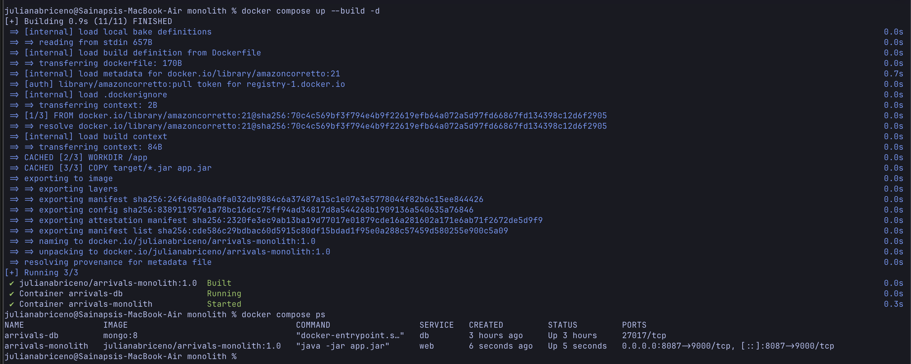
*Figure 3. `docker compose up` builds the monolith image and starts both containers. `docker compose ps` shows `arrivals-monolith` and `arrivals-db` with status `Up`, and only the monolith publishes a port (`0.0.0.0:8087->9000/tcp`).*

Then, in another terminal, build and run the gateway:

```bash
cd gateway
mvn clean package
MONOLITH_URL=http://localhost:8087 java -jar target/gateway.jar
```

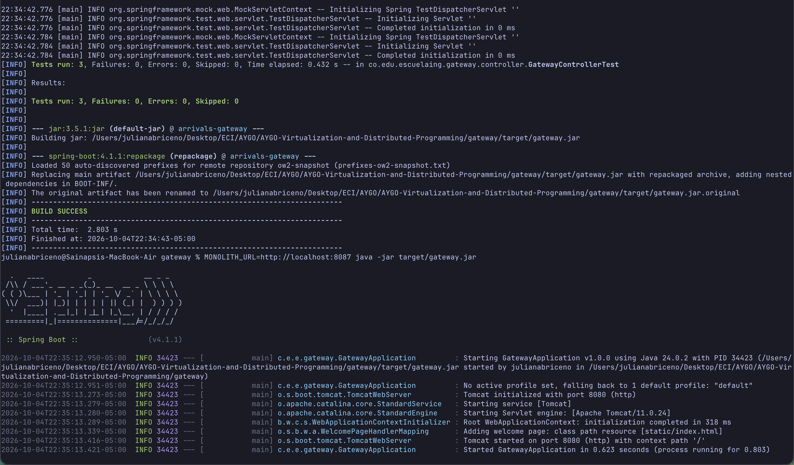
*Figure 4. The gateway build ends with `BUILD SUCCESS` (3 tests passed), and the startup log shows `Tomcat started on port 8080` and `Started GatewayApplication`.*

Open <http://localhost:8080>.

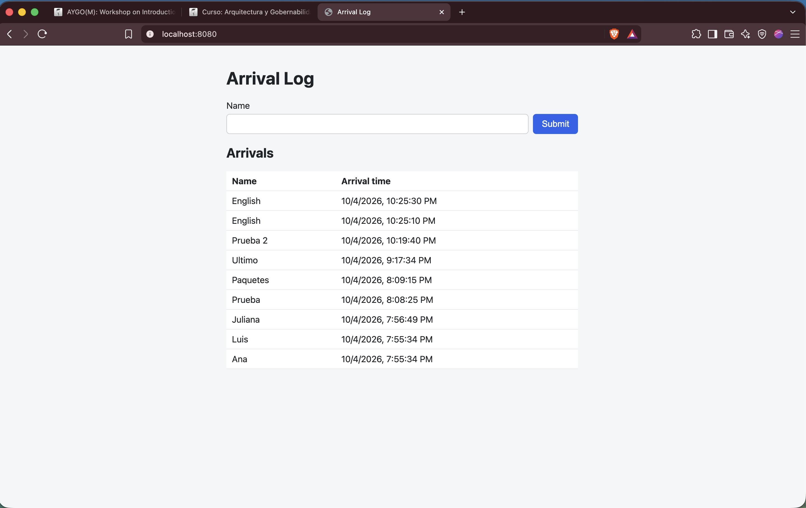
*Figure 5. The application at `localhost:8080` after registering a few names locally, with the list of arrivals below the form.*

## Building the monolith image

The image is built for both `linux/amd64` and `linux/arm64`. If it is built only on a Mac with Apple Silicon, it targets `arm64` alone, and an `x86_64` EC2 fails to pull it with `no matching manifest for linux/amd64`.

The image is published under your own Docker Hub account. Set your username once in the terminal; the following commands use it:

```bash
export DOCKERHUB_USER=<your-dockerhub-username>
```

The jar must be built first, because the Dockerfile copies it from `target/`. Then log in to Docker Hub:

```bash
cd monolith
mvn clean package
docker login
```

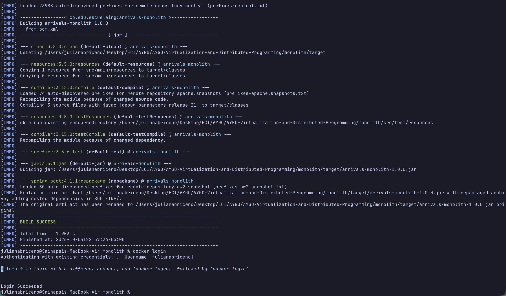
*Figure 6. `docker login` ends with `Login Succeeded`.*

Build the image for both architectures and push it in a single step:

```bash
docker buildx build --platform linux/amd64,linux/arm64 \
  -t $DOCKERHUB_USER/arrivals-monolith:1.0 --push .
```

If `buildx` says the builder does not support multiple platforms, run `docker buildx create --use` and try again.

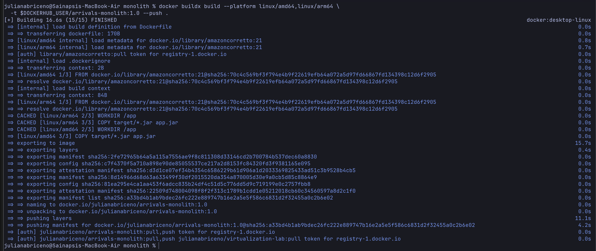
*Figure 7. `docker buildx build` building the image for `linux/amd64` and `linux/arm64` in parallel, and ending with `pushing manifest for docker.io/<your-dockerhub-username>/arrivals-monolith:1.0`.*

Check that both architectures were published:

```bash
docker buildx imagetools inspect $DOCKERHUB_USER/arrivals-monolith:1.0
```

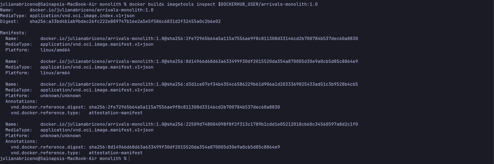
*Figure 8. Output of `docker buildx imagetools inspect`: the image manifest lists one entry for `linux/amd64` and one for `linux/arm64`.*

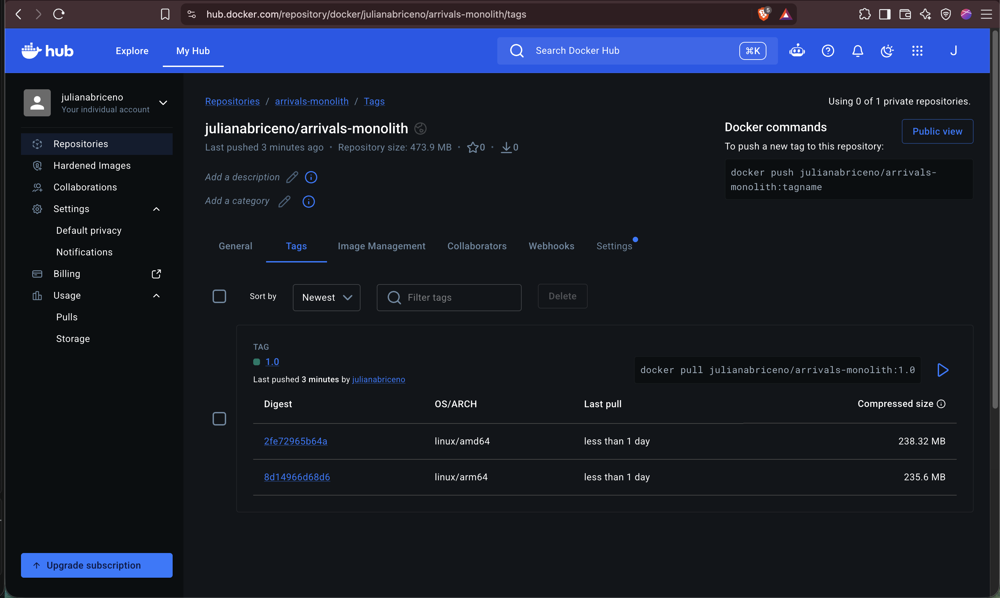
*Figure 9. The `arrivals-monolith` repository on Docker Hub, showing tag `1.0` with both architectures under OS/ARCH.*

## Deploying to AWS

### Security Groups

| Instance | Port | Source | Purpose |
|---|---|---|---|
| EC2 #1 (gateway) | 8080 | `0.0.0.0/0` | User access |
| EC2 #1 (gateway) | 22 | Your IP | SSH |
| EC2 #2 (monolith) | 8087 | **The gateway's Security Group** | Only the gateway can call the monolith |
| EC2 #2 (monolith) | 22 | Your IP | SSH |

Port 27017 (MongoDB) is never opened.

### EC2 #2: monolith + MongoDB

Install Docker and let `ec2-user` use it without `sudo`:

```bash
sudo dnf install -y docker
sudo systemctl enable --now docker
sudo usermod -aG docker ec2-user
# log out of SSH and back in for the group change to take effect
```

After logging back in:

```bash
docker --version
systemctl is-active docker
groups
```

Amazon Linux does not include the Docker Compose plugin, so it is installed by hand:

```bash
sudo mkdir -p /usr/local/lib/docker/cli-plugins
sudo curl -SL https://github.com/docker/compose/releases/latest/download/docker-compose-linux-x86_64 \
  -o /usr/local/lib/docker/cli-plugins/docker-compose
sudo chmod +x /usr/local/lib/docker/cli-plugins/docker-compose
docker compose version
```

From your machine, copy `compose.yaml` to the instance:

```bash
scp -i <your-key>.pem monolith/compose.yaml ec2-user@<EC2_2_PUBLIC_IP>:~
```

On EC2 #2, tell Compose which Docker Hub account to pull the monolith from, then pull the images. Compose reads the `.env` file in the same folder as `compose.yaml`, so the value is kept for later commands too:

```bash
echo "DOCKERHUB_USER=<your-dockerhub-username>" > .env
docker compose pull
```

Start the containers and check that the monolith answers:

```bash
docker compose up -d --no-build
docker compose ps
curl localhost:8087/arrivals
```

Write down this instance's **private IP**. The gateway needs it.

```bash
hostname -I
```

### EC2 #1: API Gateway

Install Java 21 and create the folder for the jar:

```bash
sudo dnf install -y java-21-amazon-corretto-headless
sudo mkdir -p /opt/gateway
sudo chown ec2-user:ec2-user /opt/gateway
java -version
```

From your machine, build the gateway and copy the jar and the service file:

```bash
cd gateway
mvn clean package
scp -i <your-key>.pem target/gateway.jar deploy/gateway.service ec2-user@<EC2_1_PUBLIC_IP>:~
```

On EC2 #1, move the jar into place and set the monolith's private IP in the service file:

```bash
mv ~/gateway.jar /opt/gateway/
# Replace <MONOLITH_PRIVATE_IP> with the private IP of EC2 #2
sed -i 's/<MONOLITH_PRIVATE_IP>/172.31.x.x/' ~/gateway.service
sudo mv ~/gateway.service /etc/systemd/system/
cat /etc/systemd/system/gateway.service
```

Register and start the service:

```bash
sudo systemctl daemon-reload
sudo systemctl enable --now gateway
sudo systemctl status gateway
```

To confirm the gateway can reach the monolith over the private network, run this from EC2 #1:

```bash
curl http://<EC2_2_PRIVATE_IP>:8087/arrivals
```

Open `http://<EC2_1_PUBLIC_IP>:8080`.

## Testing

### Automated tests

```bash
cd gateway && mvn test
```

They cover name validation (empty and longer than 100 characters → `400`) and the `502` response when the monolith is unavailable.


### The application in the browser

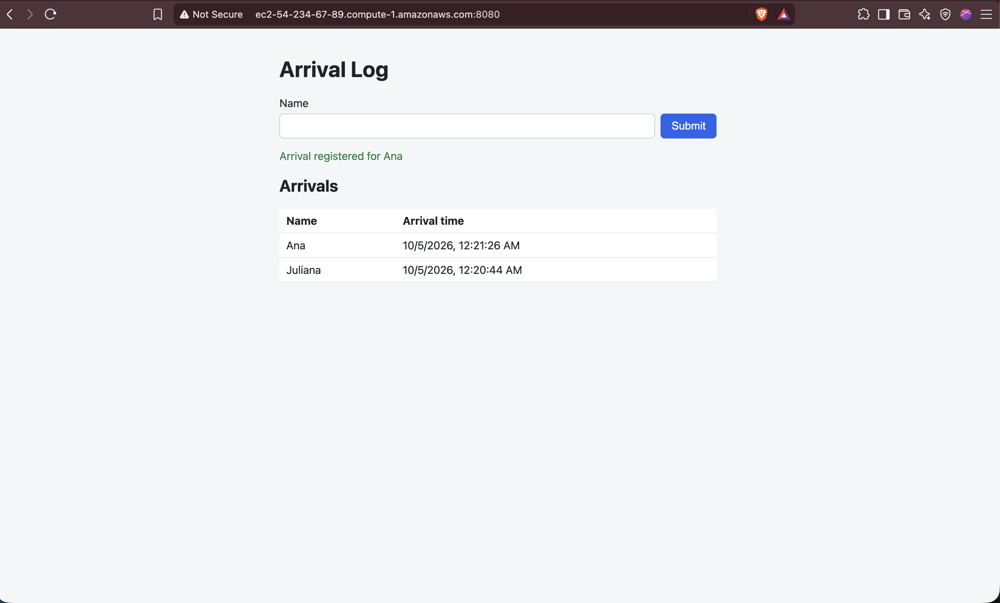
*Figure 25. The page served from the gateway's public IP (visible in the address bar) after registering several names. The success message appears under the form, and the table lists every arrival with its local time, newest first.*

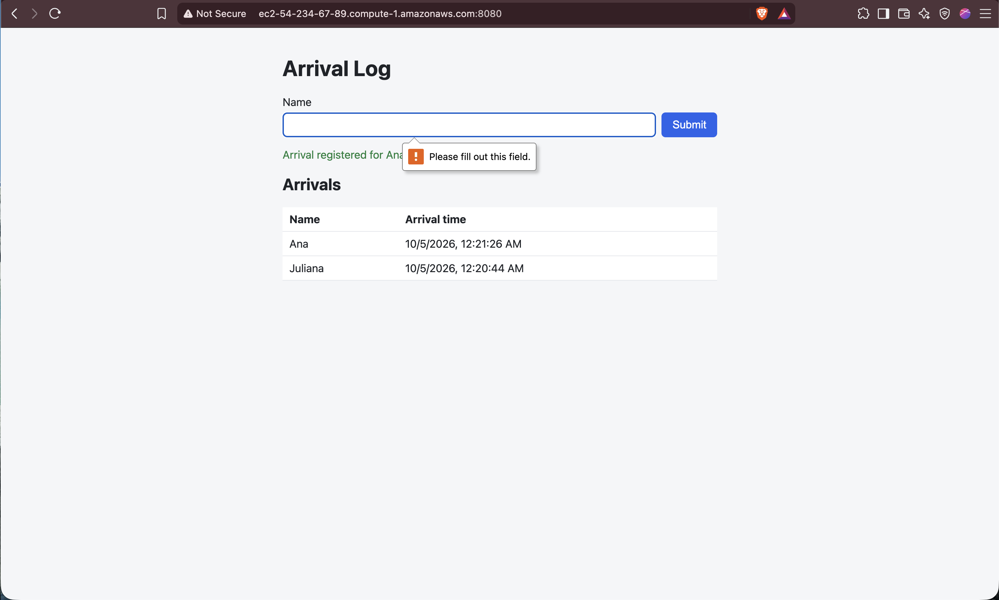
*Figure 26. Submitting a name made only of spaces: the page shows "Name is required" below the form, no new row is added and the page does not reload. The browser rejects it before sending anything; the gateway applies the same rule on its side and answers `400` when the request comes from another client (Figure 27).*

### Manual tests with curl

```bash
GW=http://<EC2_1_PUBLIC_IP>:8080

# Register an arrival → 201
curl -i -X POST $GW/api/arrivals -H 'Content-Type: application/json' -d '{"name":"Ana"}'

# Empty name → 400 {"error":"Name is required"}
curl -i -X POST $GW/api/arrivals -H 'Content-Type: application/json' -d '{"name":""}'

# List arrivals → 200
curl -i $GW/api/arrivals
```

### Persistence

On EC2 #2, remove and recreate the containers, then list the arrivals again:

```bash
docker compose down
docker compose up -d
curl localhost:8087/arrivals
```

### Logs

```bash
# On EC2 #2
docker compose logs web
```

```bash
# On EC2 #1
journalctl -u gateway
```

## Video

The deployment process and the application working (registering names and retrieving the arrival list) are shown in this video:

**[Watch the video](<VIDEO_URL>)**
